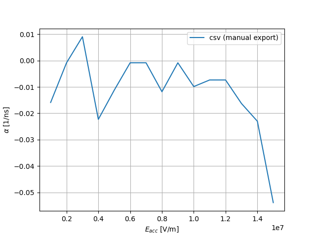
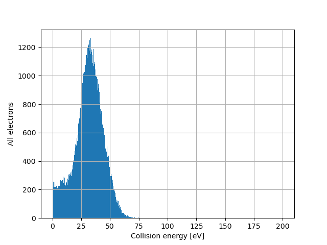
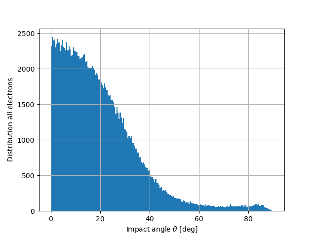
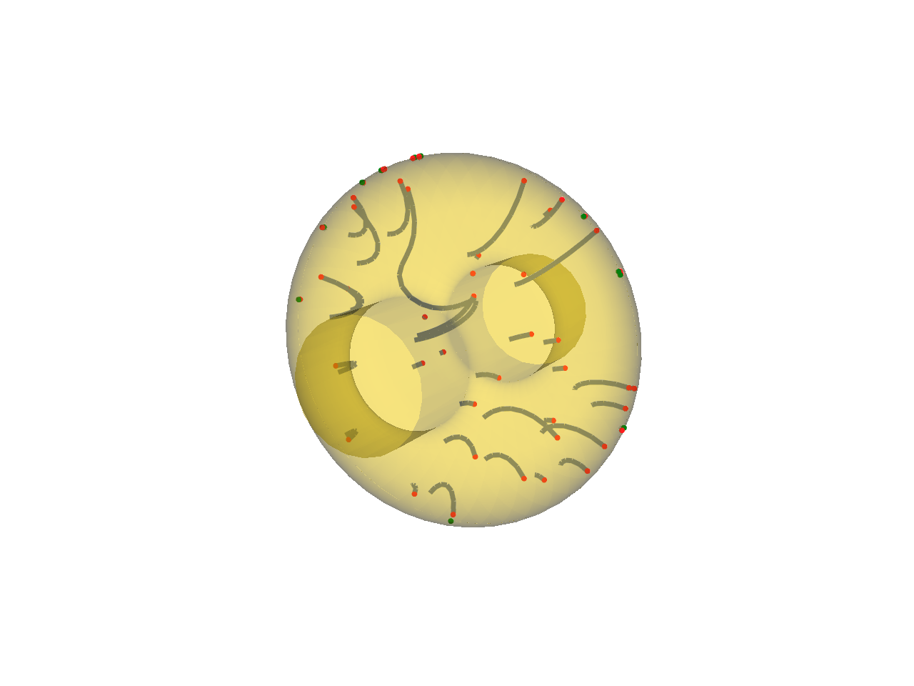

# About this package
This package is a set of utils oriented towards multipacting analysis.
In particular:
 - Load parameter sweeps and PIC Position Monitor data from CST Particle Studio.
 - Load results from SPARK3D.
 - Post-treat electron vs time results from these tools: multipactor trend, (TODO: multipactor order).
 - Post-treat CST's PIC Position Monitor:
  - Distribution of emission energies.
  - Distribution of impact energies.
  - Distribution of impact angles.
  - Visualise trajectories.

# Installation
## Requirements
You will need a recent version of Python (at least 3.11).

The `vedo` module is necessary to study collisions of particles (ParticleMonitor) with walls (impact energy, impact angle).
If you manage your distribution with `pip`, refer to: https://vedo.embl.es/docs/vedo.html#install-and-test

If you manage your installation with `conda`, run:
```
conda create -n vedo_env -c conda-forge python=3.11
conda activate vedo_env
conda install -c conda-forge numpy matplotlib pandas scipy vedo
```
Warning: in the latter case, all your packages must be installed from the `conda-forge` source, which is not the default.
You may also want to `conda install -c conda-forge spyder` to have an IDE.
And `conda install -c conda-forge jupyter` to run `.ipynb` examples.

Remember to run `conda activate vedo_env` to activate this environment.
More explanations in [this Spyder video](https://www.youtube.com/watch?v=Ul79ihg41Rs).

## Installation
Go to where you want the package to be installed:
``cd ~/my/python/packages/``

Clone the `git` repository (you can also download it as `.zip`, but you will not get any update):
``git clone git@github.com:AdrienPlacais/Simulia_Multipactor_lib.git``

# How to use
## Documentation
Documentation is available at [this link](https://adrienplacais.github.io/Simulia_Multipactor_lib/html/index.html).
It was integrated following [this tutorial](https://daler.github.io/sphinxdoc-test/includeme.html).

## Tutorial
Examples are provided in the `examples` folder and in the documentation (work in progress).

# Gallery
## Compute exponential growth factor
### From SPARK3D


### From CST
Results of a parametric study on the number of seed electrons.


## Treat CST PIC Monitor data
### Emission energies


### Collision energies


### Collision angles


### Trajectory plots
Here we represented in red the collision points and in green the emission points.
Electrons without a green point are seed electrons.




